# A Complete Tutorial on Building a Constructed-Language Input Method for Conlang Enthusiasts Worldwide (English Edition)

🌐 [中文](README.md) | **English** | [日本語](README.ja.md) | [Español](README.es.md) | [Русский](README.ru.md)

This tutorial walks you through the full process of building an input method for your own constructed language from scratch, covering three main areas: writing SVG code, creating TTF/OTF font files, and building key mappings and an on-screen keyboard in Keyman Developer.

As far as I know, there is still no complete, end-to-end guide that explains all three of these steps in detail. To fill that gap—and because existing tools for writing SVG and building TTF/OTF fonts are often not beginner-friendly enough—I used vibe coding (AI-assisted development) to build two applications of my own: an SVG code editor and a TTF/OTF font-making app. The entire tutorial is demonstrated with these two tools, so before you start reading and following along, please download both of them from the links below.

1. **SVG Code Editor**  
   [Download SVG-Code-Editor-Setup.exe](https://github.com/ajt071220-netizen/conlang-ime-tutorial-zh/releases/download/v1.0.0/SVG-Code-Editor-Setup.exe)

2. **TTF/OTF Font Maker**  
   [Download SVGFont-Studio-Setup.exe](https://github.com/ajt071220-netizen/conlang-ime-tutorial-zh/releases/download/v1.0.0/SVGFont-Studio-Setup.exe)

## I. Making Glyphs with SVG

Before we begin, we need SVG, a vector graphics format. We will draw our characters using SVG code itself. SVG (Scalable Vector Graphics) is the standard format used by mainstream input methods worldwide. With SVG, shapes described in code can be rendered as vectors in the browser or operating system according to screen density, so they stay sharp at any size—unlike PNG, which becomes blurry when scaled up. Rendering is controllable and does not depend on a pre-built font file, which is why SVG has become the industry standard for input methods. In this tutorial, we mainly use SVG shapes and paths to draw our glyphs. Paths can draw almost anything; each shape also has its own syntax. Some shapes are awkward to draw with paths alone, so below I first cover the setup work and several shapes that are easier to draw with dedicated elements—this is the SVG syntax primer for the tutorial.

### (1) Canvas size and coordinates

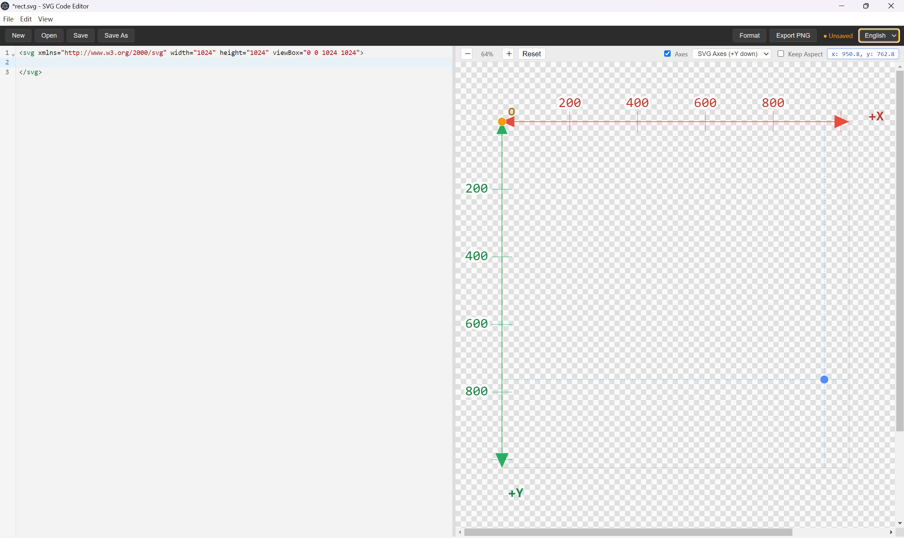

Setting up the canvas is the most basic preparation before drawing glyphs. As shown above, that setup consists of three parts: the XML namespace (`xmlns` and the long string that follows it), `width` and `height`, and `viewBox`. The last two matter most; you do not need to worry much about the first. `width` and `height` are the canvas width and height. For input-method work, **1024×1024** is the recommended size, as in the screenshot—this is the widely accepted industry standard. `viewBox` defines the coordinate system. Its four numbers mean: the first two zeros are the origin `(0, 0)`; the next two `1024` values are the width and height along the x- and y-axes. When drawing glyphs, keep width/height and the viewBox x/y ranges in a 1:1 ratio—if the width is 1024, the x range should also be 1024, and the same for height. In this software, if you are unsure where a point is, move the mouse over the canvas on the right; the coordinates of the current point will be shown clearly.

### (2) Rectangle (`rect`)

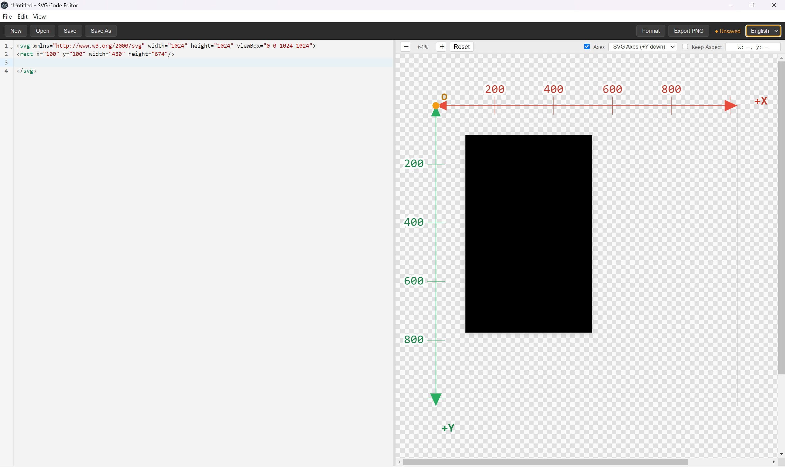 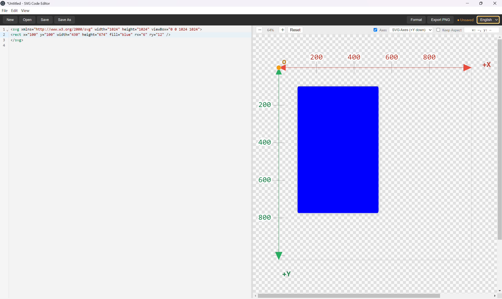

In Rectangle 1, `rect` means a rectangle; `x` and `y` are the coordinates of its top-left corner; `width` and `height` are its width and height. In Rectangle 2, `fill` is the interior fill color. `fill` is mainly used for closed shapes, but you sometimes need it for strokes as well—more on that later. `rx` and `ry` are harder to explain: they control the horizontal and vertical size of the rounded corners. Think of each rounded corner as formed by an ellipse; `rx` and `ry` are that ellipse’s axes. Rounded corners can feel abstract at first—imagine drawing an ellipse centered on the corner so it cuts the corner off with a tangent curve. This, like the curves in the path section below, is something you learn by practice and muscle memory.

### (3) Circle (`circle`)

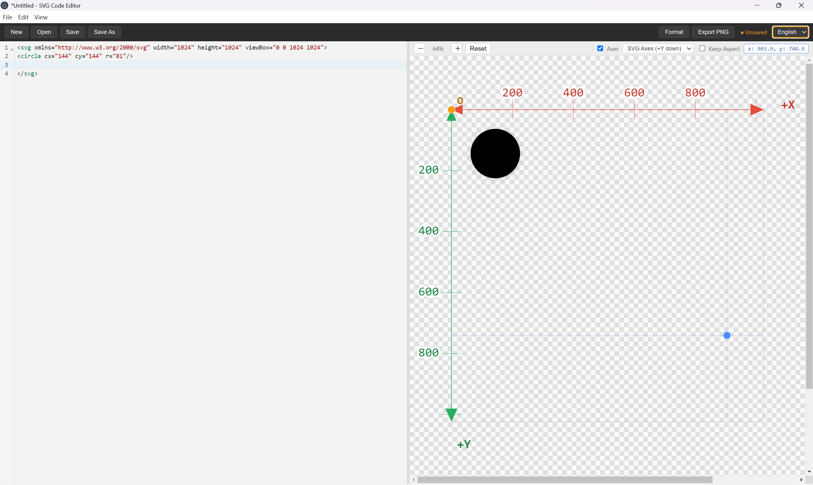

In circle code: `circle` means a circle; `cx` and `cy` are the center; `r` is the radius.

### (4) Ellipse (`ellipse`)

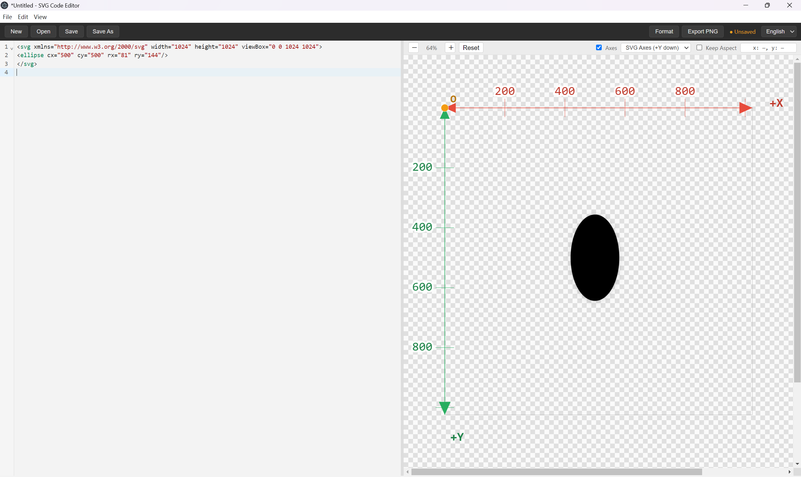

Ellipse code is similar to circle code. `ellipse` means an ellipse; the difference is that `rx` and `ry` are the horizontal and vertical radii (the longer one acts as the major axis, the shorter as the minor axis), depending on your design.

### (5) Line (`line`)

 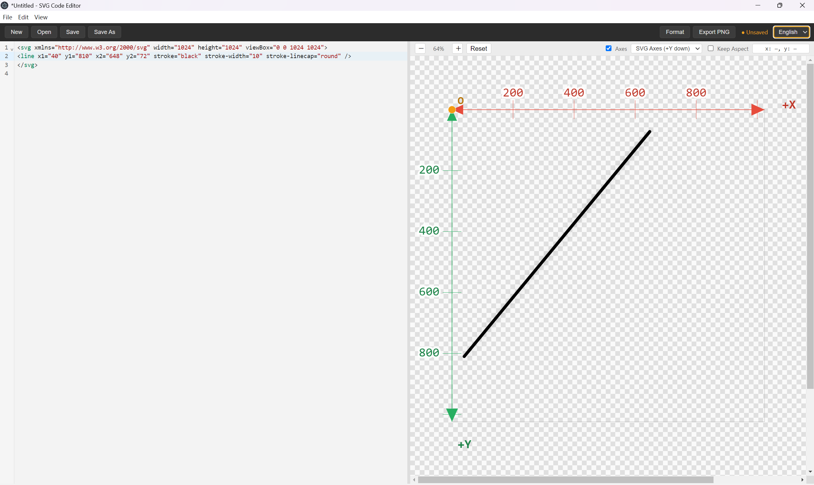 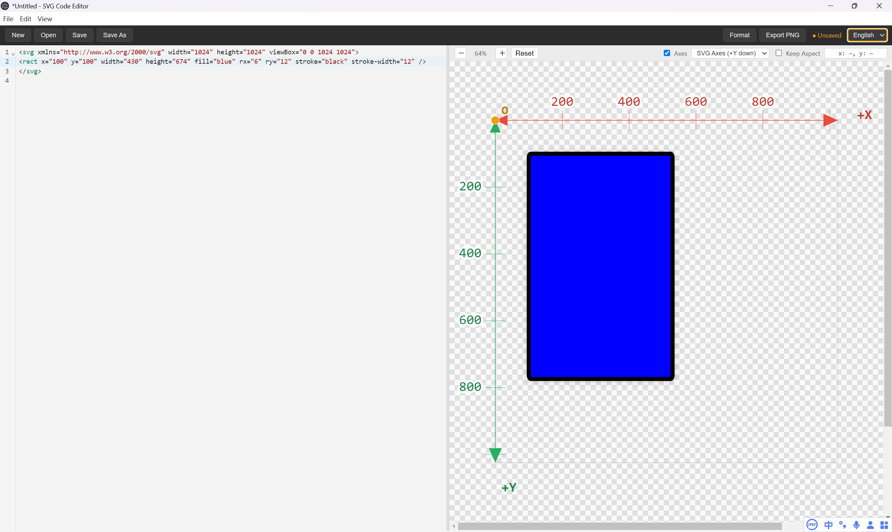

In Line 1, you see two points `(x1, y1)` and `(x2, y2)`: the start and end of the line. `stroke` is the stroke color; `stroke-width` is the thickness; `stroke-linecap` controls the end-cap shape. In the first image, `butt` is used—this is SVG’s default: flat, square ends flush with the line. In the second image, `round` gives rounded caps. These two are the most useful end-cap settings. In Rectangle 3, you can also use `stroke` and `stroke-width` to emphasize a rectangle’s outline.

### (6) Corners (`stroke-linejoin`)

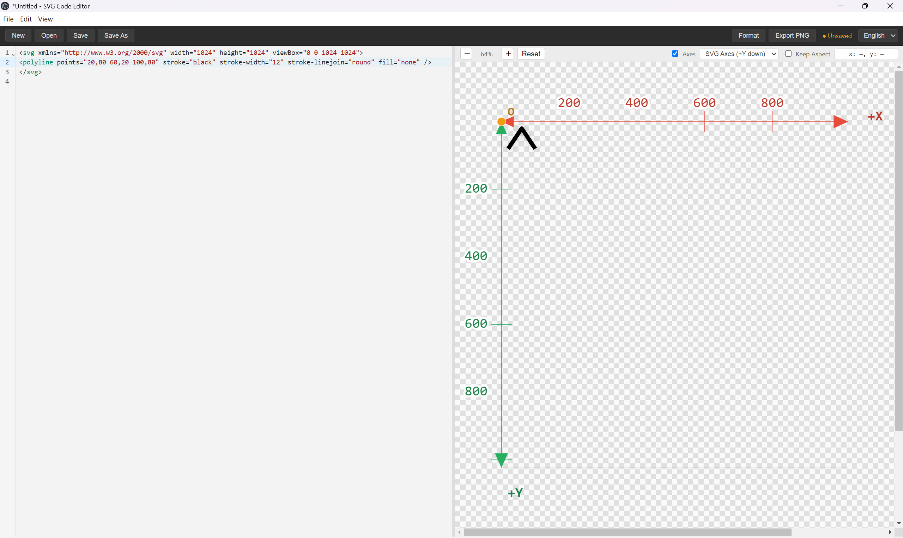 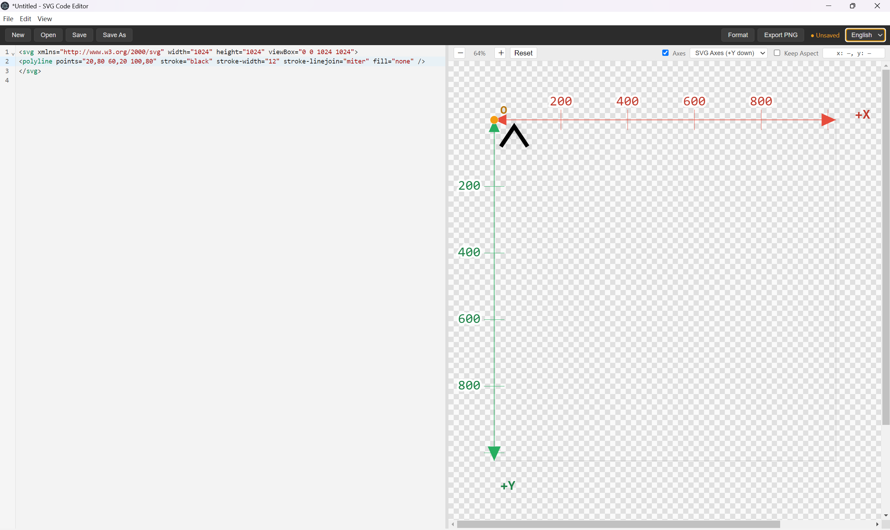 

The three images show round, sharp, and beveled corners: `round`, `miter`, and `bevel`. Joins matter most when drawing polylines. For polylines, also watch `stroke` and `stroke-width`, and set `fill="none"`—otherwise the system may try to fill from start to end as if the polyline were a closed shape.

### (7) Path (`path`)

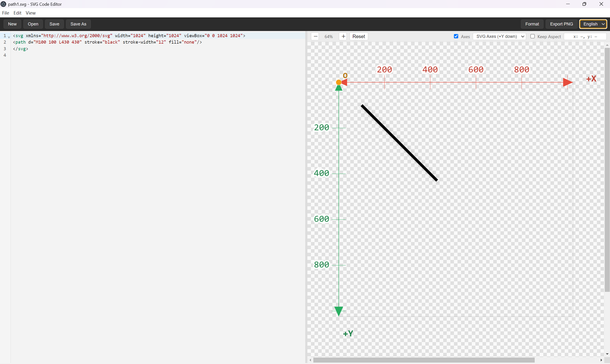 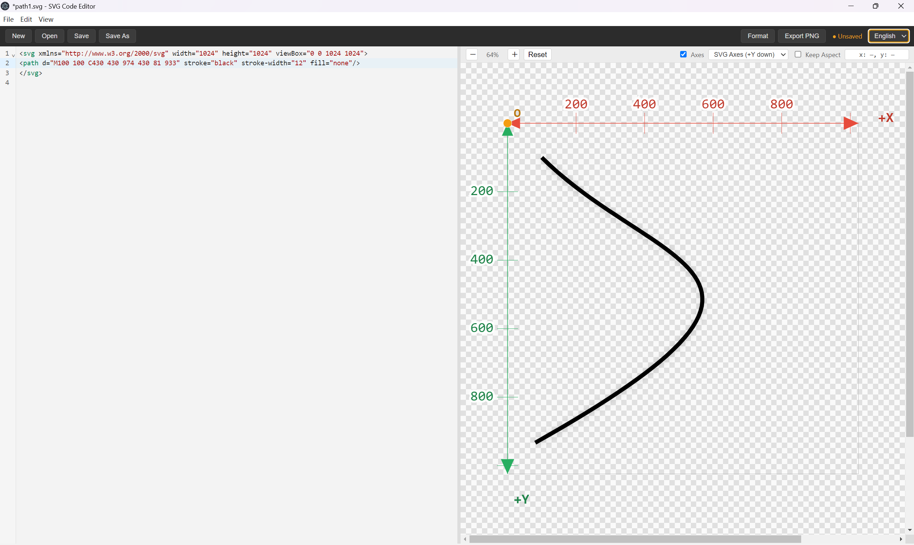 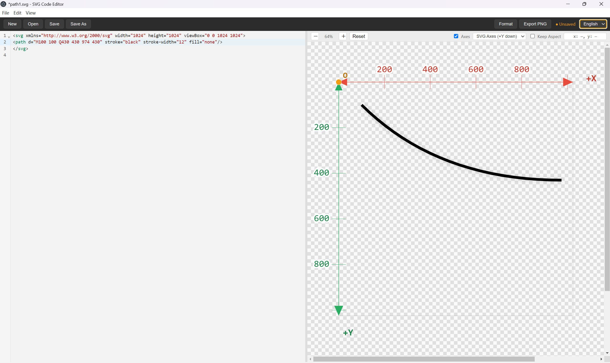

Path is the most important SVG element: you can draw almost any design with it. In the first image, `M` means *move to*—move the pen to that point as the starting point, for example `(100, 100)`. `L` means *line to*—draw a straight line to that point as the end of the segment. The second image shows curves, the most important path technique: a cubic Bézier curve. `M` still sets the start, then `C` introduces two control points. Control points are not on the curve itself; think of them as magnets pulling a wire into a bend. The closer a control point is to the bend, the sharper the curve; the farther away, the smoother. A cubic Bézier has two control points—e.g. `(430, 430)` and `(974, 430)` in the image—and a final end point; the start is still `M`. The third image is a quadratic Bézier, led by `Q`, with only one control point and a final end point. Control points take practice; work through them yourself.

That covers the SVG basics. Before Stage 2, a reminder: follow the code format in the screenshots carefully—letter case, the `<` and `/>` on each tag, and straight English double quotes `""` are all required. Especially check that the first line’s declaration starts and ends with `<` and `>` correctly; missing even one character there often breaks live preview on the right. The elements above can be mixed freely—for example, draw a straight line with a path and a circle beside it with `circle` syntax. Put the shape code between the opening SVG declaration and the closing `</svg>`. Keep both the opening declaration and the closing `</svg>` complete; even a single missing character can stop the preview and cause errors.

## II. Creating TTF/OTF Font Files

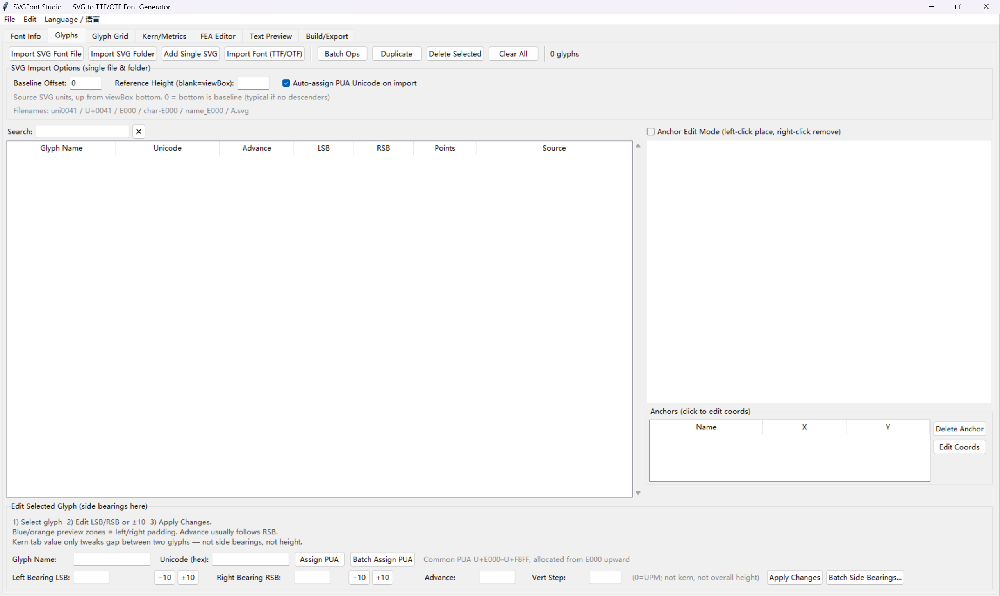

Open the font app as shown above. First, name the document / font file as you like—this name will matter later. After adjusting the initial settings, go to **Font Management** at the top, click **Add single SVG**, and choose the SVG file you saved from the SVG code editor. After upload, the app assigns a code point in the Unicode Private Use Area (PUA). Unicode is a universal character encoding standard that assigns a unique number to every character of every language and symbol, so systems can exchange text without mojibake. It is one of the core underlying standards behind input methods worldwide. The Private Use Area is a reserved block with no official meaning; users, institutions, or font vendors assign those code points themselves for special needs.

After uploading, pay attention to the controls under the glyph: left and right side bearings (**LSB** and **RSB**) and advance width. Using Latin letters as a rough reference on a **1024×1024 UPM**:

- Narrow lowercase letters such as `i` and `j`: about **220–320**
- Slightly wider ones such as `f`, `t`, `r`: about **280–400**
- Ordinary lowercase such as `a`, `n`, `o`, `e`: about **480–620**
- Wide lowercase such as `w`, `m`: about **750–920**
- Ordinary uppercase: about **580–720**
- Very wide uppercase such as `W`, `M`: about **800–1000**

As a rule of thumb, each side bearing is often about **8%–18%** of the advance width. Because PUA code points are assigned in order, upload your glyphs in the order of your own alphabet when possible. Then go to **Generate / Export** and click **Generate font** to build your TTF.

## III. Downloading and Using Keyman Developer & Keyman for Windows

This is the core of the project—and the most critical step. On this input-method development engine, we combine the font you made and finish the keyboard. First, download both programs from the official site:

- [Download Keyman Developer](https://keyman.com/developer/download)
- [Download Keyman for Windows](https://downloads.keyman.com/windows/stable/18.0.249/keyman-18.0.249.exe)

**Note:** If the direct link fails, open the [official Keyman for Windows download page](https://keyman.com/windows/download) and download manually.

After installing, open Keyman Developer for the first time, click **New Project**, choose **Keyman keyboard**, then enter a name and description for your keyboard. I recommend using the Latin transliteration of your conlang’s name for both. Click **OK** to create the project. In the project tree, select **Keyman keyboard**, then open the `.kmn` file named after your language.

Next, open **View** in the top-left menu and choose **Character Font**. Search for the font family name you created earlier (**without** the `.ttf` extension), click **Apply**, then **OK**. You may see an error dialog saying the size must be between 0 and 0. If that happens, ignore it: after **Apply**, if **OK** triggers the dialog, simply close the dialog and the font chooser. We will fix the on-screen keyboard font elsewhere below.

Then open the **Layout** tab among the main tabs, switch from **Design** to **Code**, and under `group(main) using keys` on around line 14, start writing rules from line 15. Each rule looks like:

```text
+ [K_A] > U+E000
```

(with a space after `+`, after `]`, and around `>`). `[K_A]` means the physical `A` key (lowercase `a` when Shift is not held). Map your letters’ Unicode values to keys as you like—we will mainly use the on-screen keyboard later, not the physical keyboard. The `+` and `>` are required, and there must be spaces as shown. Keep each key paired with the correct Unicode. You can use `[K_B]`, `[K_C]`, and so on; do not forget the underscore.

After you have as many key rules as letters in your alphabet, open **On-Screen** under Layout and click **Fill from layout**. That copies the mappings onto the on-screen keyboard, but it does **not** by itself make your custom glyphs appear on the keycaps. Click the **Code** view for On-Screen, find around line 8:

```xml
<encoding name="unicode" fontname="Arial" fontsize="-12">
```

Change `fontname` from `Arial` to your font’s family name (keep the quotes), and change `fontsize` to **`-16`**—keep the quotes and the minus sign; only change the number. After that, the keycaps can show your font’s characters. Back in **Design**, you may still see blank keycaps; clicking a key may show what looks like an empty space in the **Text** field. That is fine—those are Private Use Area characters and often do not render in the designer. Do not worry.

When finished, open **Build**, and under **File actions** click **Compile Keyboard**. When the **Messages** panel shows a green line ending in **built successfully**, the keyboard compiled. Then open the project tab (the one for your package project), go to **Packaging**, open the `.kps` file, select the keyboard, and under **Languages** click **Add**. In the dialog’s first **Tag** field, enter a language tag of at most three letters, then save. Click **File → Save**. Compile again from **Build**: under **File actions**, click **Compile Package**. You should again see **Built successfully**.

Next, open **Keyman for Windows** and click **Start Keyman**. The window may close; check that Keyman appears in the system tray (the up-arrow area near the clock). If it is there, Keyman is running. Return to Keyman Developer, open the `.kps` file’s **Build** page, and click **Install**. After installation finishes, use the input-method switcher near the clock, select your new keyboard, open the tray Keyman menu, and choose **On Screen Keyboard**. A virtual keyboard should appear with your glyphs on the keycaps—you can start typing.
