# 致全世界所有人造语言爱好者的一份完整的人造语言输入法详细制作教程（中文版）

🌐 **中文** | [English](README.en.md)

本文依次从SVG代码编写、TTF/OTF字体文件制作、Keyman Developer的触控映射代码编写以及屏幕键盘的制作等三个主要方面完整介绍了从零基础开始制作有关于自己的人造语言输入法的全流程教程。

鉴于全球目前没有一份完整的从这三个步骤全方位解析如何详细制作自己的人造语言输入法的教程。为此，我专门使用氛围编程先解决了目前市面上没有足够好用和方便新手上手的SVG代码编辑器以及TTF/OTF字体文件制作应用的问题，我首先是通过氛围编程去分别开发了一款SVG代码编辑器以及TTF/OTF字体文件制作应用。这两个软件作为在本教程的全程演示都在该两款软件上，所以每位读者在正式开始阅读并此教程动手制作属于自己的人造语言的输入法之前，都需要按照以下的链接来下载两款软件，以便于可以更好的理解与实践教程。

1. **SVG 代码编辑器**  
   [点击下载 SVG-Code-Editor-Setup.exe](https://github.com/ajt071220-netizen/conlang-ime-tutorial-zh/releases/download/v1.0.0/SVG-Code-Editor-Setup.exe)

2. **TTF/OTF 字体文件制作应用**  
   [点击下载 SVGFont-Studio-Setup.exe](https://github.com/ajt071220-netizen/conlang-ime-tutorial-zh/releases/download/v1.0.0/SVGFont-Studio-Setup.exe)

一. SVG字体制作教程
首先在教程开始之前，我们需要用到一种叫做SVG的矢量图形格式，通过其本身的SVG代码来绘制我们的文字， SVG（Scalable Vector Graphics, 可缩放矢量图形）格式是目前全球主流输入法的标配格式。 SVG格式下可以确保由代码所描述形状的文本在浏览器或者系统中可以被系统按照屏幕密度进行实时的矢量绘制，永远保持锐利，而不是像PNG那种格式在成倍数放大的情况下，就会出现图片模糊的现象，并且整体渲染可控，不依赖字体文件本身，所以这也导致这种格式成为了全球主流输入法的标配格式。 在本教程中，我们主要使用SVG的图形与路径来绘制自己的文字图案。路径可以画出一切的图形以及其他各种各样的图案，每一个图形也有自己的单独语法。在绝大多数情况下，有一些图形使用路径去绘制比较麻烦，所以我接下来在这里先介绍开始之前的准备工作以及几种主要依靠路径画出来比较麻烦的图形,作为本教程关于SVG语法的入门章节。

 （1）画布的大小与坐标设定
  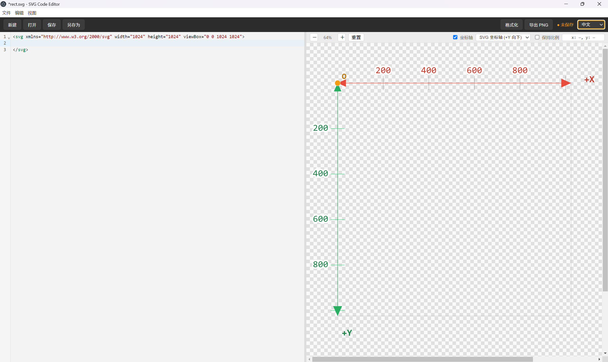
画布是绘制字体之前当中的一个最基本的准备工作，在上述图片当中，我们可以看见，最开始的准备工作分别由XML Namespace(XML命名空间, 就是xmlns及其后面那一大串符号)、width和height、Viewbox三大部分所构成。而其中最重要的是后两者，至于第1个是什么的话，不需要过多关注。width和height分别是画布的宽度和高度, 在输入法制作当中的画布宽度与高度设定的一个最佳尺寸为1024×1024,也就是如我的上图所表示的那样。这是目前行业内的公认标准。Viewbox则是画布的坐标，其中的4个数字分别代表的是，开头的两个0与零则代表坐标系当中的（0，0），即为原点，接下来的两个1024分别代表了画布的长度在坐标轴上面的坐标。后者则代表了画布的高度在坐标轴上的坐标，则分别对应x轴和y轴。在绘制字体的该工作当中，需要保证长度和高度与x轴和y轴的比例可以达成1:1，也就是长度是1024，那么x轴的坐标也需要是1024，反之，高度亦然。而且在本软件中，当你不确定某一个坐标点的具体位置时，你可以将鼠标移动至右侧的画布当中，这样在坐标轴上会明确显示出当前所在坐标点的单位。
 
 （2）矩形（rect）
  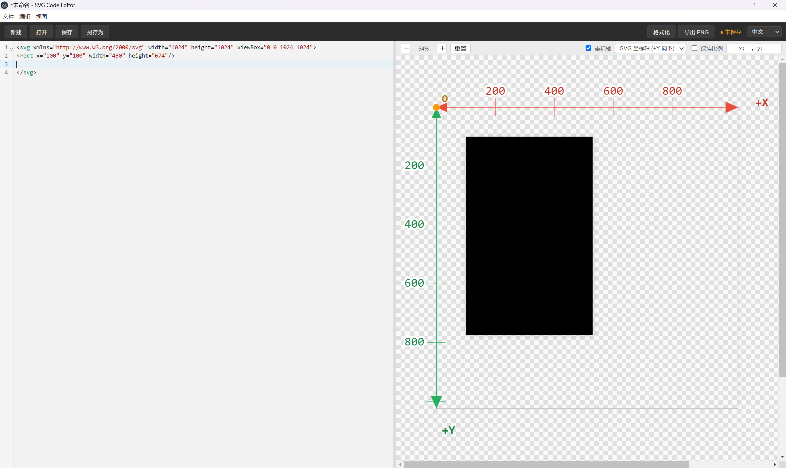 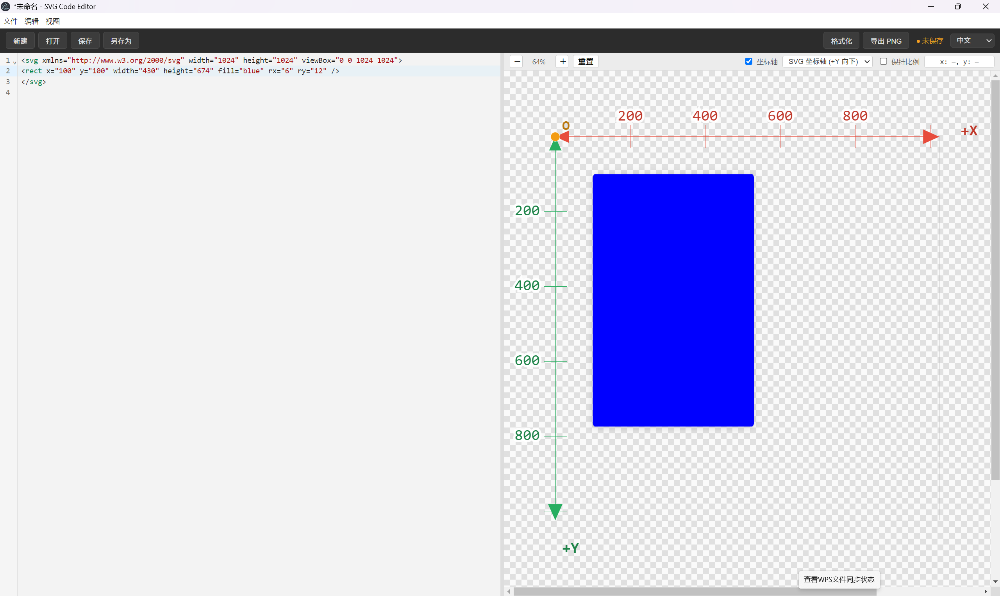
由上图矩形1可知，在代码所表示的含义当中，开头的rect指代的是矩形，x和y指的是矩形左上角的所在坐标;width和height则指的是矩形的宽度和长度，而在矩形2当中，fill指代的则是矩形内部所填充的颜色,而fill这个填充功能绝大多数情况下广泛适用于封闭图形，但是当你在绘制其他的线段的时候，有时也需要利用fill，这个下文会提及到。rx和ry则比较难解释，这两个条件指代了矩形二这个图片当中圆角的这个横向长度和纵向长度可以理解为圆角是由椭圆形构成的，而这个rx和ry就是这个所构成圆角的椭圆形的长轴或者短轴，圆角这个概念并不是很好理解，你可以理解成是以所在点为圆心去画椭圆形，而椭圆形则覆盖掉原来的角，形成相切的情况，这个仍需要自己去练习和体会，是SVG当中和下文路径当中的曲线一样非常依赖肌肉记忆与经验的部分。

 （3）圆形（circle）
  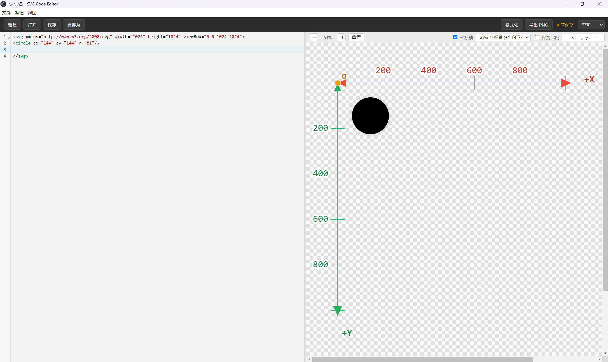
在圆形的代码当中各要素分别指代的含义如下: circle指代的是圆形 cx和cy指的是圆心的所在坐标;r指的是圆的半径。

 （4）椭圆（ellipse）
  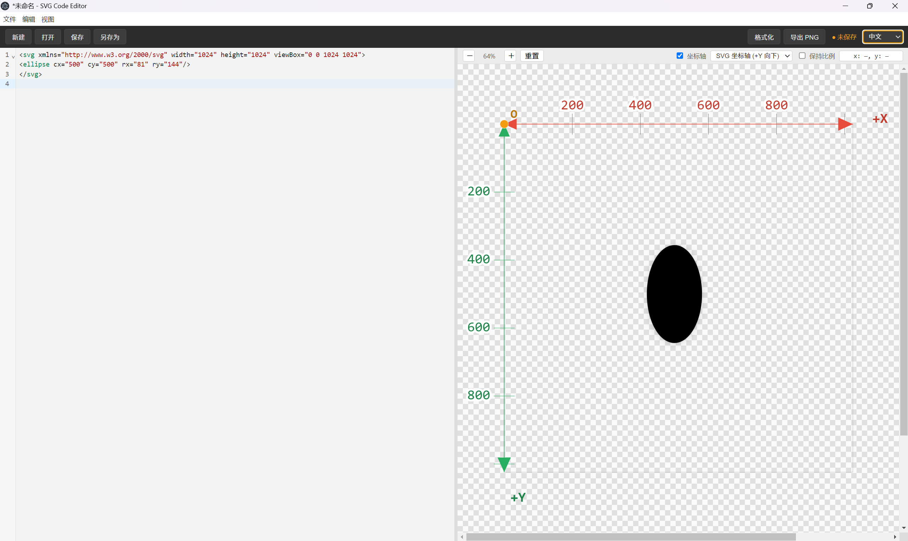
椭圆的代码与上述圆形的代码大致相同，ellipse指代的是椭圆形，不一样的点是rx和ry则分别指代了椭圆当中的长轴与短轴。这个依然依据个人的设定，比如说rx长,ry短，那就是前者为长轴，后者为短轴，反之则是后前者为短轴，后者为长轴。

 （5）直线（line）
  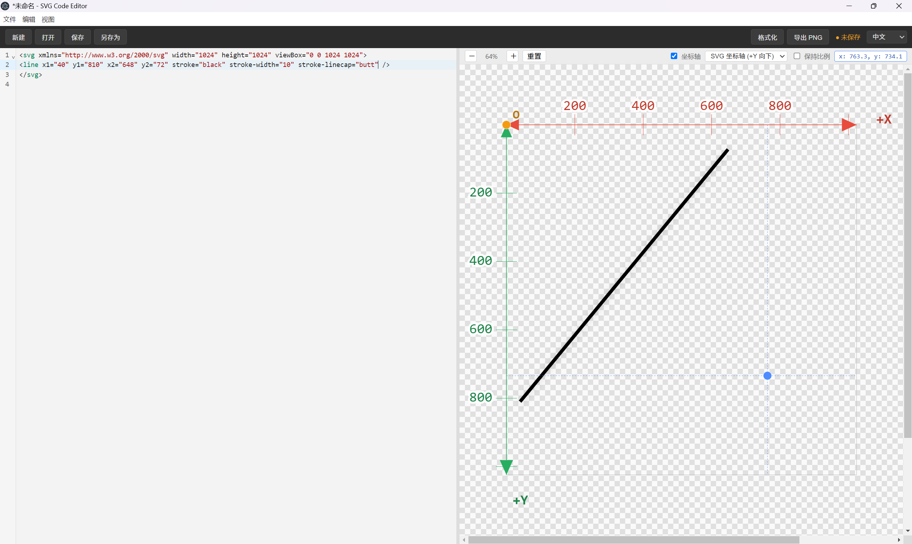 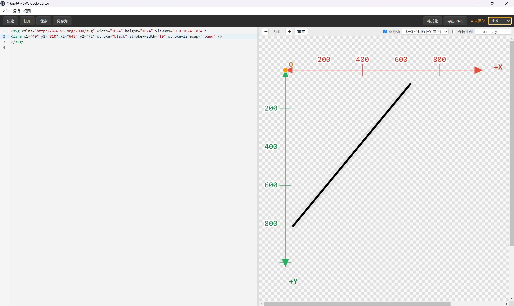 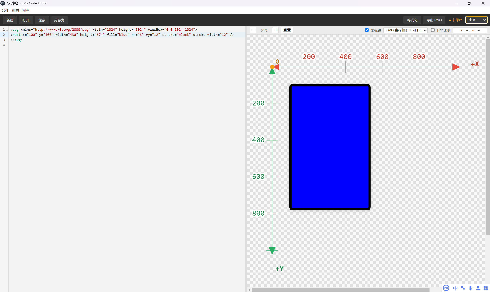
 首先在上述的直线1的那张图片当中，我们可以发现有两个坐标点(x1,y1)和（x2，y2），这两个坐标分别指的是直线的首端和末端的坐标点。stroke指的是线段颜色，是整个直线的颜色,stroke-width则代表了整个线段的宽度，也就是粗细.stroke-linecap则表示的是线段两端的末端形状,butt在第1张图片当中是作为了这个线段的末端形状，这同时也是整个SVG当中的一个默认设置，也就是你可以在第1张图片上所看到的，该线段的末端两侧均匀平直的形状,第2张图片当中的round则是代表了线段两侧末端的圆角形状。而这是两种最实用的线段末端形状设置。而在矩形3的这张图片当中，还可以通过使用上文介绍过的stroke和stroke-width这两个功能对于矩形进行轮廓边缘的突出。

  (6)拐角（stroke-linejoin）
  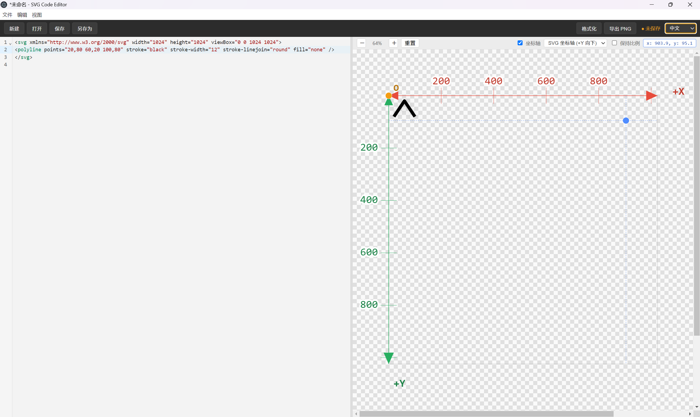 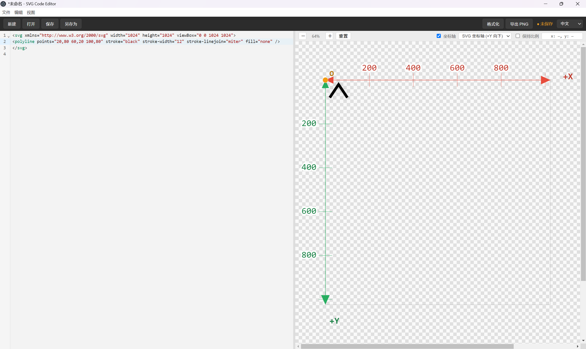 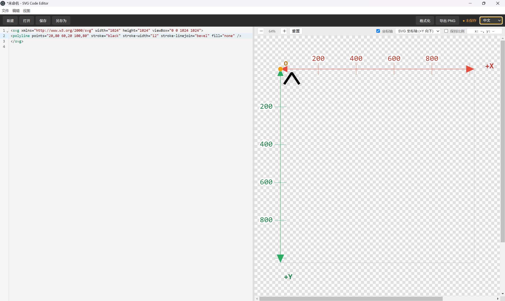
上述三图当中的拐角则分别代表了圆角，尖角，平角，分别是round,miter,bevel,拐角在折线当中是最主要的适用场景。同时在绘制折线的时候，需要同样注意stroke，stroke-width这二者。以及需要特殊标注fill=none这一概念，否则系统极有可能会把折线的首尾两端强行尝试用涂色的方式变成一个封闭图形。

 （7）路径(path)
  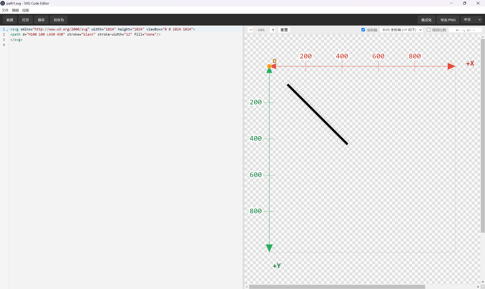 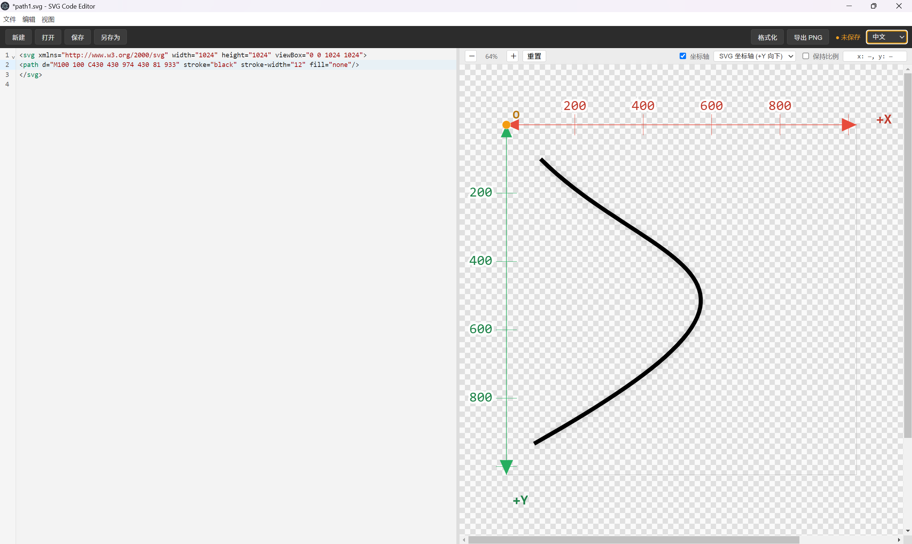 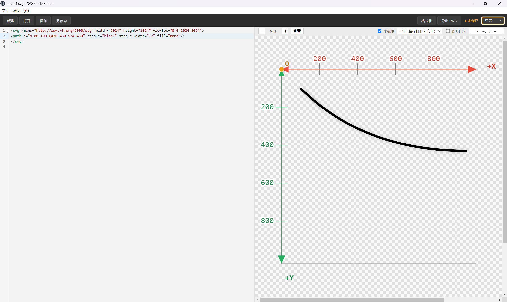
路径是SVG当中最重要的一种格式，可以绘制出一切图案。在第1张图片当中，M所表达的含义是move to，也就是将画笔移动至此作为起点，移动至你所指示的坐标点，比如我图中所移动到的（100，100），以此作为画图的起点，L则表示了line to，意味着是移动到该坐标点，作为该线段的末端。在图片二当中，则是代表了曲线，也就是路径当中最重要的一种方式。这是三次贝塞尔曲线，上面可以看到M依然是和之前一模一样，但是上面多了一个C,C则代表了两个控制点，控制点这个概念，并不是特别好理解，你可以理解为一块磁铁，而曲线是这根铁丝控制点是吸引曲线弯曲的一个地方，但是本身并不在曲线之上，控制点距离弯曲部分越近，弯曲部分会越尖锐，越远则越圆滑。三次贝塞尔曲线拥有两个坐标点，像我图片二当中的（430，430）和（974，430），而最后一个点则为整个线段的终点，而起点则依然是M。图片3是二次贝塞尔曲线，前方的引领字母换成Q，二次贝塞尔曲线只有一个控制点，最后一个坐标点为整个线段的末端终点。但是由于控制点这个概念本身的理解偏难，所以仍需读者们自行去进行练习。自此我们将所有的SVG基础情况全部介绍完毕，但是在此进入第二阶段之前，仍然需要提醒大家严格按照图片当中所展示的格式去进行代码的书写，包括字母的大小写，以及每一行开头的<和/>,以及英文输入法当中的""这些都是必不可缺的，而且尤其需要检查第1行的首端和末端是否拥有<和>，因为第1行的声明部分往往最容易被人忽略，而在第1行的声明部分只要缺少任何一个字符，都有可能导致右侧画布无法进行实时预览。另外就是第1部分上述的这些教程的成分都是互通的，比如你可以用路径画一条直线的同时，同时在这个直线旁边用圆形的语法去画出一个自己想要的原形。只需要在第一行的声明和结尾的 `</svg>` 之间去输入你想要的图案的对应代码即可。同时在注意开头的声明的结构是否完整的同时，也需要尤其注意结尾的这个 `</svg>` 是否完整，因为这两者都会对代码的情况产生影响，哪怕缺少一个最基础的符号都会导致右侧的画布无法实时产生预览图案，并且导致报错。

二.TTF/OTF字体文件制作部分
 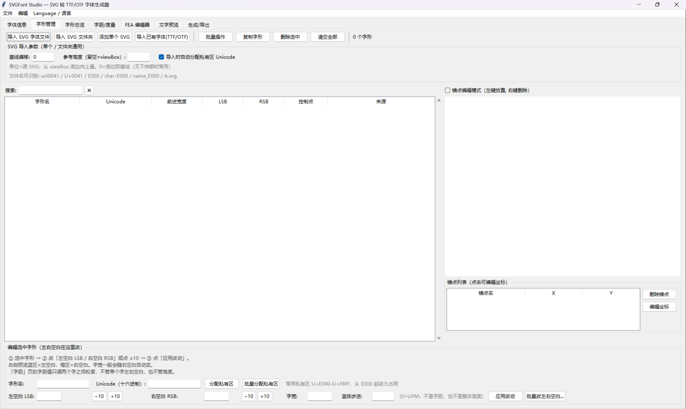 
 然后由上图，再进入到这个软件之后，首先是界面最开始的文档命名部分，可以在这里按照自己的意愿去命名这个字体的文件名称，这个在之后还是有用的。下文中会提到。然后再修改好初始部分的情况之后，点击上方的字体管理部分，然后点击添加单个SVG，然后在你选择的保存你原来从刚才的那个svg代码编辑器上面制作出来的SVG文件，然后再上传好你的文件之后，会给你自动分配一个Unicode私有区的编码，这里需要介绍一下Unicode是什么东西，万国码（unicode）是一种全球通用的字符编码标准，皆在为世界上所有语言和符号的每个字符分配一个独一无二的数字编号，从而彻底解决不同系统之间的字符乱码问题，实现数据的统一交换与兼容。是目前全世界所有的输入法背后的最核心的底层技术标准之一。而私有区则是其中预留的特定码段，这些码位的字符可能是没有官方统一含义，完全交由用户机构或字体厂商自定义分配，用于满足各种特殊需求。紧接着在上传完图片之后，我们需要关注图片下方的调节左右空白，也就是LSB和RSB，以及字宽的这三个选项。接下来会用拉丁字母来进行举例，去给大家作为一个字体宽度的参考。在拉丁字母中，i和j这样的偏窄字母的字宽通常为220至320，略宽的f,t,r的这种则为280至400。像a,n,o,e这样的常规小写字母的字宽为480至620，像w,m这样的偏宽小写为750至920。常规字母大写则为580至720，像最宽的W,M这样的字母最大字宽为800至1000，这一切都基于1024×1024的UPM，并且在按照经验来看的取值区间当中，单侧空白应该为字体宽度的8%至18%左右。而且由于按照私有区的编码顺序，所以各位在上传自己的文字的时候，最好按照你自己所规定的字母表上的顺序上传。然后紧接着来到上方的生成/导出部分去点击生成字体，生成你自己的TTF字体。

## 三. Keyman Developer & Keyman for Windows 的下载与使用

好的，这是本次开发工作的重头戏，也是最关键的一步。我们将在这个输入法的开发引擎上，结合之前的字体，在这里完成最终一步的开发。首先我们需要去官网下载这两个软件：

- [点击下载 Keyman Developer](https://keyman.com/developer/download)
- [点击下载 Keyman for Windows](https://downloads.keyman.com/windows/stable/18.0.249/keyman-18.0.249.exe)

**注意：** 若直链无法下载，请打开 [Keyman 官方下载页](https://keyman.com/windows/download) 手动下载。

在下载之后首次打开 Keyman Developer 的界面，点击new project，然后点击这个之后，键盘种类选择keyman keyboard,紧接着填写关于你的这个键盘的名称和描述，这边建议是名称和描述直接填你的人造语言名称的拉丁转写就可以。然后点击下方的确定，创建这个键盘。然后先选择下方的keyman keyboard,紧接着点击你刚才所创建的你的人造语言所命名，以.kmn结尾的那个文件。然后在进入之后先找到左上方的view,点击之后，底下有个character font。然后搜索你刚才制作的字体文件名称（不用带.ttf的后缀），找见之后点击应用，然后再点击确定，但是有可能在点击确定之后会出现一个报错，就比如说会出现一个要求你大小必须在零与零之间的一个弹窗，遇见这个弹窗不需要管，你就只需要点击应用之后，如果再点击确定。但是如果点击确定之后会出现这个弹窗，那你就直接把整个弹窗连同他的这个字体文件的选择框关掉，然后接下来下文中会提到这个东西的问题该去哪里解决。紧接着再点击5个指示栏上的layout，点击下方的code（下方有一个design和code），然后进入代码界面之后，在第14行的group(main) using keys下面开启第15行，然后每一行的代码格式都是+ [K_A] > U+E000(之间有4个空格)，这个[K_A]指的是Key A，也就是小写的a键，在这里咱们直接按照上面的阿拉伯数字以及字母对应的这种去随便对应咱们的字母所对应的unicode的就可以，因为咱们本身不用实体键盘，咱们之后会用到屏幕键盘，这个我下文会说到，注意，代码当中的+和>这些必须要有，而且+和[K_A],以及>这4个之间是必须要有一个空格，然后还需要确保每一个按键和每一个字母所对应的Unicode之间都需要对应，[K_A]当中的A也可以换成任何其他字母或者数字，比如[K_B],[K_C]这些，但是切记一定不要忘了要加上下划线。然后在完成了与你的字母数量相同的按键对应之后，来到左侧的layout下方的on screen，点击上方的Fill from layout,这样就在屏幕键盘上面完成了触控映射，但是完成触控映射并不代表会帮我们在屏幕键盘的每一个键位上浮现出我们的符号。接下来我们还需要在on screen的下方点击下方的那个code的图标，进入到它的代码层之后，我们需要找到第8行：`<encoding name="unicode" fontname="Arial" fontsize="-12">`，然后把那个 fontname（字体名称）从 Arial 改为你自己的字体文件的名字（不要改动两侧的双引号），紧接着再把后面的 fontsize（字体尺寸）改为 **-16**，注意保留两侧的英文直双引号和里面的负号，只改数字即可。然后改完之后键帽上才会出现原来字体文件的字符。但是再回到design界面之后，我们会发现，我们依然看不到键帽上有任何字符，每点击一个对应的字符键帽，我们都可以在底下的text看见一个空白的空格，然后后面跟着一个输入线，不用担心，这个就是你字体当中的对应的这个键帽的字母了，只不过它是私有区文字，所以在这里无法显示，这不要紧。，然后在做完这些之后，直接点击下方的build，点击file actions下面的Compile Keyboard,当下方的messages栏里面出现一行绿色的话，并且在末尾你可以看到 built successfully这两个单词的时候就证明你的这个文件已经编译成功了。紧接着再点击上方的.kpi在那个标签里，就是点击以这个为尾缀的那个标签，然后再回到标签之后点击下方的Packaging,点击上方的以.kps为尾缀的那个文件，进入之后点击里面的keyboard，然后在那个languages底下点击那个add，在弹出来的弹窗的第一个Tag里面输入语言的名字，由于是输入的缩写，所以最长只能输入三个字母，然后保存即可。这个过程结束之后，还需要在这个文件的上方点击File，然后在里面点击Save,然后也去同样的下方的build里面做同样的动作，也就是完成编译，点击comfile actions下面的comfile package 在编译结束之后，同样也会出现一个 Built successfully.紧接着，我们打开下载好的Keyman for Windows，点击 Start Keyman，然后点击之后，这个窗口会自动关闭，然后观察一下这个是否已经出现在了任务栏当中，如果出现在了任务栏当中，也就是电脑的右下角有一个向上的一个小箭头，点击一下，看看是否出现在了上面，如果出现在任务栏当中，那就证明这个东西已经启动了。然后这个时候我们再回到Keyman Developer当中，在以.kps这个尾缀结尾的文件这里同样是点击他的build，在进入这个文件之后点击它的build，因为你刚才没有关闭这两个文件的话，它这两个文件是都在的，直接点击build，然后在里面的install当中，点击这个install，然后这就正式下载好键盘了。紧接着，在等待结束之后，在右下角的输入法切换当中，点击当前输入法，观察上方弹窗中是否有这个输入法，如果有你刚才的输入法的话，点击那个输入法，然后再点击向上的箭头，拉出任务栏，在任务栏中点击keyman，然后在里面再点击顶部的on screen keyboard，召唤出屏幕键盘，然后你这个时候就正式可以在你的电脑右下角发现一个虚拟键盘了，上面每一个键帽上都会有你的对应的字母，然后就可以开始输入了。
